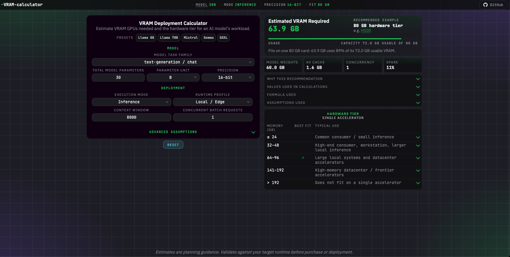

<div align="center">


<h1>L∞pGate</h1>
<p><em>frontend edition</em></p>

#### Originally built to demo [L∞pGate for frontend](https://github.com/rxdt/loopgate_js)

# [AI Deployment Calculator](https://vram.rxdt.dev/)

A free VRAM calculator for AI models. Not just for LLMs: text generation,
embeddings, vision, multimodal, image diffusion, video, audio, and tabular
workloads, across inference, LoRA/QLoRA fine-tuning, and full training.

Static Vite + TypeScript. Every calculation runs in the browser. No backend,
no ads, no signup, no tracking. The formula, per-component breakdown, and
assumptions behind every estimate are shown in the UI, and recommendations are
measured against _usable_ VRAM (advertised capacity minus the driver/CUDA
reserve), **not** the sticker number.

_[Based on the (more mature) Python ralph agent harness](https://github.com/rxdt/loopgate_harness)_



</div>

## Supports

- text generation, embeddings, encoder-decoder, vision, multimodal
- image diffusion, video, audio, tabular, and custom workloads
- inference, LoRA, QLoRA, and full-training estimates
- known model file size overrides, MoE, sharding, and runtime assumptions

## Calculates

- usable VRAM required
- recommended hardware memory tier
- minimum advertised GPU capacity
- usable target, headroom, rough speed, formula, and assumptions

Core equation:

```txt
Required_GB = (Weights + Working_Memory + Training_State + Runtime_Overhead) * Buffer
```

Estimates vary with model architecture, kernels, quantization, sequence packing,
batching, sharding, offload, framework overhead, and runtime configuration.
Validate against your target stack before buying hardware.

## Run Locally

```sh
pnpm install
pnpm setup
pnpm dev
```

## Build

```sh
pnpm build
pnpm preview
```

> **Profiling note:** Always run Lighthouse against the production preview
> (`pnpm build && pnpm preview`, served on `127.0.0.1:4183`), never the dev
> server (`pnpm dev`, `127.0.0.1:5174`). The dev server serves raw unbundled
> modules over an HMR WebSocket, so a report taken there shows unminified JS,
> unused `zod`, no-bf-cache, and a large CLS from the serialized module
> waterfall — all dev-only artifacts, none of which exist in the deployed
> build. `harness/lighthouserc.cjs` already targets `preview` for this reason.

## Development Checks

```sh
# checks
pnpm preflight
pnpm gate
pnpm --prefix frontend run test:coverage
pnpm --prefix frontend run test:e2e
```

## Key Files

- UI: `frontend/index.html` and `frontend/src/app.ts`
- State: `frontend/src/state.ts`
- Calculation: `frontend/src/calculator-core.ts`, `frontend/src/workload-memory.ts`
- Hardware tiers: `frontend/src/hardware.ts`
- Report assembly: `frontend/src/report.ts`
- Specs: `specs/plan.md`, `specs/qa.md`

## Requirements

- Node.js `^22.16.0 || >=24.8.0`
- pnpm `>=10` (`pnpm@11.9.0` declared)

---

# Why build this

**Without a real app in production a harness cannot be trusted. This app was developed alongside [L∞pGate JS](https://github.com/rxdt/loopgate_js) to learn from (painfully) and serve as `v0` proof.** As a fan of dev tooling, meta-absuridism, and cycles, building the most deterministic self-referential Ai tool conceivable on the fly _(an AI GPU calculator)_ all while building a looping harness just felt right.

Generally, frontend work has a messy non-deterministic contract. Yet an app must remain accessible/build/render/respond/fit across viewports and loading paths. _AND_ have ✨taste✨. UI has a gradient of quality and Agents stop ASAP unless forced to improve. That's why this heavy WIP harness is here. With web we don't get simple deterministic outcome like with a [Python harness](https://github.com/rxdt/loopgate_harness). A frontend agent can pass tests while shipping a blank page. So the loop is strict on purpose The harness uses tooling to force an agent to build an app to look like a human did. These checks cover different failure modes:

- TS, HTML, CSS, JSON format
- lint
- types
- architecture
- dead code
- security
- build
- unit coverage
- e2e Playwright
- Lighthouse must be 100
- preferences.ts checking for smells that an app is not responsive...
- etc.

Agents struggle more with frontend for structural reasons. They can reason over code, but frontend correctness is not simply in code text. It is the interaction between:

- generated HTML
- bundled JS
- CSS cascade
- layout engine
- viewport size
- browser defaults
- assets
- async hydration
- events
- accessibility tree
- CSP/headers
- performance timing

A backend bug has a crisp functional target, e.g. this function returns wrong value. A frontend issue often says without words: “the thing looks wrong”. Agents need heavy tool feedback to _'see'_ issues or they are guessing from source. [`loopgate_js`](https://github.com/rxdt/loopgate_js) harness doesn't promise to fix all of the above. It is a first attempt to expose some and enforce that agents make fixes.
