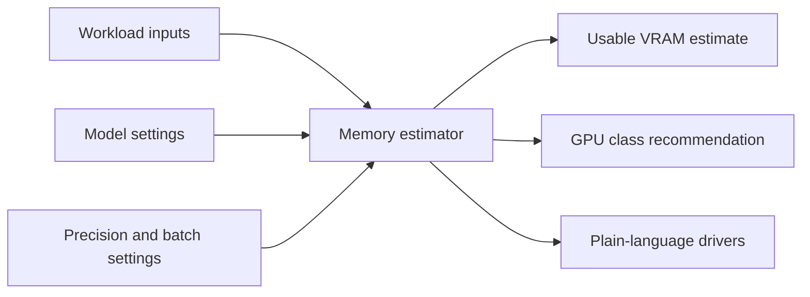

# AI Deployment Calculator

A browser-only calculator for estimating the GPU memory needed to run or train
AI workloads. It is meant to give a practical sizing answer before choosing
hardware, not to replace benchmark runs on a target stack.

The calculator covers text generation, embeddings and classification,
encoder-decoder models, vision, multimodal models, diffusion, video generation,
speech and audio, tabular ML, and custom workloads. It gives the clearest answer
for transformer inference, and marks rougher estimates for workloads where
runtime memory depends heavily on implementation details.

Use it when you need a quick usable-VRAM estimate, a recommended GPU class, and a
plain explanation of what drove the number. It does not estimate cloud cost,
latency under load, power, storage, networking, or provider availability.

Project contracts live in `specs/plan.md`; frontend implementation details live
in `specs/frontend.md`. README stays as the human entry point.

## Flow



## Install

```sh
npm run setup
```
`setup` installs harness dependencies, installs discovered package directories,
adds missing root harness scripts, sets Git hooks, and rewrites harness commands
to use any existing user config file, even if that file is empty. Setup checks
for config file presence only; the check command validates the config later
([harness/cli.ts](harness/cli.ts#L263)).

It deliberately does not run `npm setup` at the repository root. Root
`package.json` has an `setup` script that launches harness setup.

## Run
```sh
cd frontend && npm run dev -- --port 5173
```
`http://127.0.0.1:5173`.

Build:
```sh
cd frontend && npm run build
```
Preview:
```sh
cd frontend && npm run preview
```

## Faster checks
```sh
npm run preflight
```

## Full checks (lint, tests, security, type-checking, etc.)
```sh
npm run gate
```

## Harness behavior

`preflight` runs only the fast commit checks in `COMMIT_CHECKS`
([harness/gate.ts](harness/gate.ts#L124),
[harness/gate.ts](harness/gate.ts#L660)). `gate` runs `FULL_CHECKS`, which
adds typecheck, security, build, coverage, browser, size, and Lighthouse checks
([harness/gate.ts](harness/gate.ts#L156),
[harness/gate.ts](harness/gate.ts#L692)).

Only loop preflight (`RALPH_LOOP=1`) unstages forbidden paths or files that add
forbidden patterns. It warns on stderr when it unstages files
([harness/gate.ts](harness/gate.ts#L569)). Normal preflight and gate leave
staged files alone.

## Loop
```sh
npm run harness loop <agent> <#> <$>
```

For any other harness command, use `npm run harness -- <command>`.

> do NOT DELETE!:

## Owner notes. DO NOT DELETE!!

- Semgrep CA trust-store issue triggered from sandbox. `env -u SEMGREP_SEND_METRICS harness loop...` with agent launch bypasses,
- Except for `plan.md`, all `.md` documents should stay < 100 lines.
- prompt precedence/context leakage into the worker when orchestrator launches headless agent even when prompt says _'do NOT orchestrate, do THIS.'_
- when running an orchestrator, `harness loop codex` is giving the child enough context that it follows specs/orchestrate.md
- using the old harness Python ralph.sh NOT the new (supposted to be identical Js ralph.sh)
- `Claude flags --bare --no-session-persistence --fork-session`
- npm exec --package . -- harness loop codex 1 20
- `CLAUDE_CODE_EXPERIMENTAL_AGENT_TEAMS=1 claude -p --permission-mode acceptEdits --output-format stream-json "Act as the team lead. Create an agent team, split this repo work into frontend verification, backend/docs verification, and review teammates. Coordinate through the shared task list. Do not run nested harness commands."` <- orchestrater prompt
- `codex exec --json "Spawn explorer and worker subagents..."`, Codex spawns flat, parallel worker threads (explorer, reviewer, worker) in a managed cloud environment or local worktree to split up tasks simultaneously. Sub-types: default, worker, explorer (read-heavy). ORCHESTRATE: Spawn two Codex subagents:
  - explorer: read-only, map the relevant files and risks.
  - worker: implement the smallest fix after explorer reports. Wait for both, reconcile conflicts, then run verification.
  - `brew install gitleaks` must be run by users. Same as `osv` scanner.

> do NOT DELETE!:
